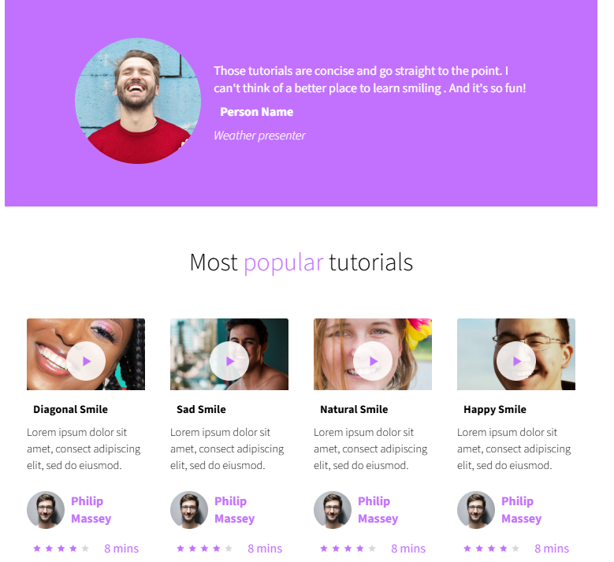

## ALX advanced css project

---

## 🚀 Live Demo

You can view the project here:  
👉 [smileSchool- Live Page](https://kateykwesi.github.io/smileSchool-/)

---

## 🛠️ Technologies Used

- **HTML5** – for structure
- **CSS3** – for styling and layout

---

## 🎯 Learning Objectives

1. Apply semantic HTML for accessible web content.
2. Use CSS selectors, classes, and IDs effectively.
3. Implement layout techniques with **Flexbox**.
4. Design visually appealing and consistent pages.

---

## 📸 Screenshots



---

## 💡 How to Run

1. Clone this repository:
   ```bash
   git clone https://github.com/KateyKwesi/smileSchool-.git
   ```
